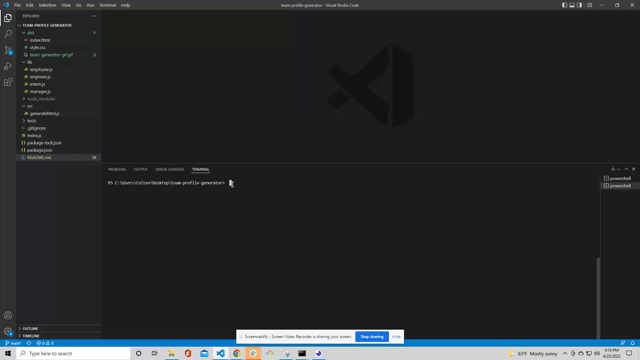

# team-profile-generator

 ## Table of Contents
  
- [Description](#description)
- [Installation](#installation)
- [Usage](#usage)
- [License](#license)
- [Contributors](#contributors)
- [Tests](#tests)
- [Technologies Used](#technologies-used)
- [Questions](#questions)

  
  ## Description
  
 Team Member Generator is a web app that is designed to load team member information and display it on a webpage. After all necessary parts to run this project are installed, the user will be prompted with multiple questions about each member they would like to add, deciding between a manager, interns, and engineers. Once the list of team members is complete, the cards will generate on the HTML page and there will be a notice on the command line of terminal letting the user know the cards have been generated.
  
  ## Installation
  
  This project will require the user to download inquirer and jest in order to run the program properly after cloning it down.
  
  ## Usage 
  
  Please reference the video to see the proper usage for the Team Member generator.
  For a full video with audio of the project, go to ADD VIDEO.

  

  ## Tests

  The user will need to install jest. Reference video below for tutorial:

  

  ## Technologies Used
  
  - HTML
  - CSS
  - Javascript
  - Node.js
  - Jest

  ## Contributors
  
  Kylie Shinn

  - GitHub: [github](https://github.com/kyliemshinn)
  - LinkedIn: [linkedin](https://www.linkedin.com/feed/)
  
  ## Questions
  
  For additional information please contact me at:
  Email: kyliemshinn@gmail.com

  ## License

  MIT License

Copyright (c) [2022] [Kylie Shinn]

Permission is hereby granted, free of charge, to any person obtaining a copy
of this software and associated documentation files (the "Software"), to deal
in the Software without restriction, including without limitation the rights
to use, copy, modify, merge, publish, distribute, sublicense, and/or sell
copies of the Software, and to permit persons to whom the Software is
furnished to do so, subject to the following conditions:

The above copyright notice and this permission notice shall be included in all
copies or substantial portions of the Software.

THE SOFTWARE IS PROVIDED "AS IS", WITHOUT WARRANTY OF ANY KIND, EXPRESS OR
IMPLIED, INCLUDING BUT NOT LIMITED TO THE WARRANTIES OF MERCHANTABILITY,
FITNESS FOR A PARTICULAR PURPOSE AND NONINFRINGEMENT. IN NO EVENT SHALL THE
AUTHORS OR COPYRIGHT HOLDERS BE LIABLE FOR ANY CLAIM, DAMAGES OR OTHER
LIABILITY, WHETHER IN AN ACTION OF CONTRACT, TORT OR OTHERWISE, ARISING FROM,
OUT OF OR IN CONNECTION WITH THE SOFTWARE OR THE USE OR OTHER DEALINGS IN THE
SOFTWARE.